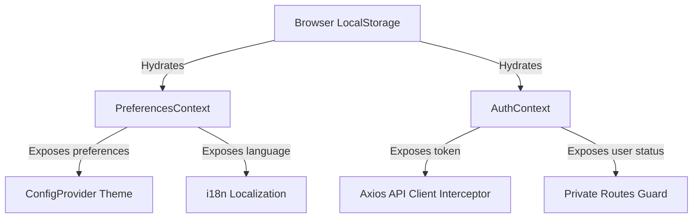
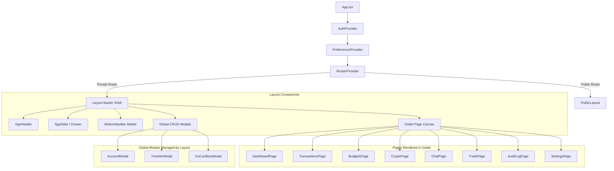

# Architecture & Tech Stack

This document details the software architecture, tech stack, and module structure of the NexaBudget Frontend application.

## 🛠️ Technology Stack

NexaBudget Frontend is designed as a modern Single Page Application (SPA) leveraging the latest standard tools in the React ecosystem:

* **React 19**: Core UI rendering engine. Takes advantage of concurrent rendering and modern JSX compilation.
* **TypeScript 5.8**: Strictly enforces type safety across components, contexts, custom hooks, and API responses (mapped to `src/types/api.ts`).
* **Vite 7**: Next-generation build tool that provides instant Hot Module Replacement (HMR) during development and optimized Rollup-based bundling for production.
* **Ant Design 6**: Enterprise-grade UI component library. Implements CSS-in-JS style injection, modular component styling, and a clean, responsive layout grid.
* **React Router 7**: Managed client-side routing, utilizing data APIs (`createBrowserRouter`, `RouterProvider`) and nested layout outlets.
* **Day.js**: Lightweight alternative to Moment.js for date parsing, validation, manipulation, and formatting.
* **i18next**: Internationalization framework supporting complete bilingual localization (English & Italian).

---

## 🏗️ State Management & Data Flow

NexaBudget relies on React's Context API rather than a heavy global state manager (like Redux or Zustand). State is localized where needed, and global concerns are split into dedicated contexts:

### 1. Authentication (`src/contexts/AuthContext.tsx`)

Manages the user session and credential tokens:

* Retrieves initial auth data from `localStorage`.
* Propagates the `AuthResponse` object (containing `token`, `userId`, `username`, and preference fields) to the entire application.
* Persists the JWT token under `authToken` and user profile under `auth` in `localStorage`.
* Exposes `login()`, `logout()`, and `updateUser()` hooks.

### 2. User Preferences (`src/contexts/PreferencesContext.tsx`)

Maintains display configurations across sessions:

* **Theme**: Toggle between `'light'` and `'dark'` modes, mapped directly to Ant Design's `defaultAlgorithm` and `darkAlgorithm` via the root `<ConfigProvider>`.
* **Language**: Manages translation locale (`'en'` or `'it'`), dynamically invoking `i18n.changeLanguage()` when changed.
* **Server Settings**: Stores server URLs and timeout options.



---

## 🗂️ Application Shell & Layout

The entrypoint of the application is [App.tsx](file:///Users/nicolaiacovelli/WebstormProjects/nexabudget-fe/src/App.tsx), which configures context providers, routing tables, and the Ant Design application scope.

For all authenticated views, [Layout.tsx](file:///Users/nicolaiacovelli/WebstormProjects/nexabudget-fe/src/components/Layout.tsx) serves as the **Master Application Shell**. It is responsible for orchestrating the persistent layout, sharing global database records, and hosting shared action triggers.

### Shared State & Modals in Layout

To prevent reduntant API calls and prop drilling, the `Layout` component manages:

1. **Account List State**: Fetches and caches the list of all financial accounts (`Account[]`) and the aggregated preferred balance.
2. **Category List State**: Fetches and caches active transaction categories (`Category[]`).
3. **Global Modal Triggers**: Hosts overlay modals that can be summoned from various places in the UI:
    * `AccountModal`: Add or edit checking, savings, investment, or cash accounts.
    * `TransferModal`: Log transaction transfers between two accounts (including multi-currency conversion).
    * `GoCardlessModal`: Guided wizard to link banks through Open Banking APIs.
4. **Transaction Refresh Signals**: Exposes a toggleable counter (`transactionRefreshKey`) to notify child components (e.g. transaction tables) when a global operation (like creating a transfer) requires data refetching.

### Responsive Shell Structure

The layout adapts dynamically using custom breakpoints detected via `src/hooks/useBreakpoints.ts`:

* **Desktop Layout**: Renders a fixed sidebar navigation menu (`AppSider`) on the left, an utility header (`AppHeader`) on top, and the main page canvas (`Content`) in the center.
* **Mobile Layout**: Collapses the sidebar into a slide-out overlay drawer controlled by a toggle button in the header. Renders a fixed bottom navigation bar (`BottomNavBar`) optimized for touch controls.



---

## 🚦 Routing & Code Splitting

NexaBudget Frontend optimizes network load times through **Code Splitting** by separating pages into dynamic import chunks. Pages are only downloaded by the browser when the user navigates to their corresponding routes.

### Lazy Loaded Routes

Webpack-style chunks are declared using React's `lazy` helper:

```typescript
const DashboardPage = lazy(() => import('./pages/dashboard/DashboardPage').then(m => ({ default: m.DashboardPage })));
```

While loading, routes display a fallback `<LoadingSpinner />` component suspended inside a React `<Suspense>` wrapper.

### Router Guarding

The routing tree defines two custom guards to filter user access:

1. **`<PrivateRoute>`**: Checks if the user is authenticated. If no auth token is detected, it redirects the browser to `/login`.
2. **`<RedirectIfAuth>`**: Restricts access to public-only views (like registration and login). If an authenticated session exists, it automatically redirects the user to the `/dashboard`.

---

## 📱 Responsive & Mobile-First Design

Responsive style adjustments are handled natively using a dual approach:

1. **Ant Design Grid**: Utilizes flexbox layouts with `xs`, `sm`, `md`, `lg`, and `xl` breakpoints to auto-arrange dashboard metrics, tables, and graphs.
2. **Media Queries & CSS Variables**: Specialized overrides for smaller devices live in [src/mobile.css](file:///Users/nicolaiacovelli/WebstormProjects/nexabudget-fe/src/mobile.css). This includes:
    * Hiding heavy desktop elements (sider, desktop buttons) on screens smaller than `768px`.
    * Enabling full-width viewport scaling for cards and transaction rows.
    * Adjusting spacing and font sizes for better touch targets.
    * Styling the mobile bottom navigation bar (`BottomNavBar`).
