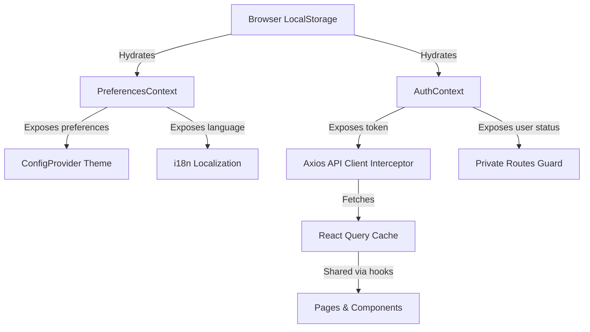
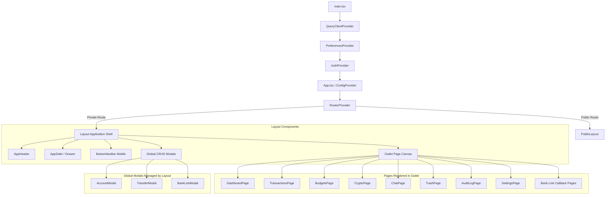

# Architecture & Tech Stack

This document details the software architecture, tech stack, and module structure of the NexaBudget Frontend application.

## 🛠️ Technology Stack

NexaBudget Frontend is designed as a modern Single Page Application (SPA) leveraging the latest standard tools in the React ecosystem:

* **React 19**: Core UI rendering engine. Takes advantage of concurrent rendering and modern JSX compilation.
* **TypeScript 6**: Strictly enforces type safety across components, contexts, custom hooks, and API responses (mapped to `src/types/api.ts`). The build config also enables `noUnusedLocals`, `noUnusedParameters`, `verbatimModuleSyntax`, and `erasableSyntaxOnly`, so unused imports and untyped type-imports fail the build rather than warn.
* **Vite 8**: Next-generation build tool that provides instant Hot Module Replacement (HMR) during development and optimized Rollup-based bundling for production.
* **Ant Design 6**: Enterprise-grade UI component library. Implements CSS-in-JS style injection, modular component styling, and a clean, responsive layout grid.
* **React Router 7**: Managed client-side routing, utilizing data APIs (`createBrowserRouter`, `RouterProvider`) and nested layout outlets.
* **TanStack Query (React Query) 5**: Server-state cache for all remote data — deduplication, background refetching, and invalidation.
* **Axios**: HTTP client, wrapped in a single configured instance with auth interceptors (see [API Client Layer](api_client.md)).
* **Day.js**: Lightweight alternative to Moment.js for date parsing, validation, manipulation, and formatting.
* **Charts**: hand-written SVG/DOM components in `src/components/dashboard/` and `src/components/reports/` — no chart library. The last G2 chart (`@ant-design/plots`) was replaced because it pulled a 1.26 MB chunk for a single donut.
* **i18next**: Internationalization framework supporting complete bilingual localization (English & Italian).

---

## 🏗️ State Management & Data Flow

NexaBudget deliberately avoids a heavyweight global store (Redux, Zustand). State is split by nature:

| State kind | Owner |
|---|---|
| Session / identity | `AuthContext` |
| UI preferences (theme, language) | `PreferencesContext` |
| Server data (accounts, categories, reports, budgets…) | React Query cache |
| Local view state (filters, form drafts, modal open flags) | Component `useState` / feature hooks |

### 1. Authentication (`src/contexts/AuthContext.tsx`)

Manages the user session and credential tokens:

* Retrieves initial auth data from `localStorage`. The stored value is parsed defensively: a corrupt entry simply starts the app logged out instead of crashing it.
* Propagates the `AuthResponse` object (containing `token`, `userId`, `username`, and preference fields) to the entire application.
* Persists the JWT token under `authToken` and user profile under `auth` in `localStorage`.
* Keeps multiple tabs consistent: a `storage` listener notices when another tab logs out or logs in as a different user, clears the React Query cache, and adopts the new session — so a tab never mixes one user's cached data with another user's token.
* Exposes `login()`, `logout()`, `updateUser()`, and `explicitLogout` (true after a deliberate logout, used by the router guard below).

Token injection into requests and automatic sign-out on an expired token are **not** handled here — they live in the Axios interceptors described in [API Client Layer](api_client.md).

### 2. User Preferences (`src/contexts/PreferencesContext.tsx`)

Maintains display configurations across sessions, serialized as a single `preferences` JSON entry in `localStorage`:

* **Theme**: Toggle between `'light'` and `'dark'` modes, mapped directly to Ant Design's `defaultAlgorithm` and `darkAlgorithm` via the root `<ConfigProvider>`.
* **Language**: Manages translation locale (`'en'` or `'it'`, default Italian), dynamically invoking `i18n.changeLanguage()` when changed. The same key is read synchronously by `src/i18n/index.ts` before React mounts, so the first paint is already in the right language.
* **Server Settings**: Stores server URLs and timeout options.

### 3. Server State (React Query)

The `QueryClient` is created in `src/main.tsx` with app-wide defaults:

```typescript
new QueryClient({
    defaultOptions: {
        queries: {
            staleTime: 2 * 60 * 1000,   // 2 minutes
            refetchOnWindowFocus: true,
            retry: 1,
        },
    },
});
```

**All query keys are declared in a single module, `src/queryKeys.ts`.** Because invalidation is key-based, inlining ad-hoc key arrays at call sites silently breaks refresh behaviour — new queries should register their key there instead.

The same module exports **`invalidateDerivedData(queryClient)`**, which invalidates every query derived from transactions — the dashboard (`queryKeys.dashboardAll`) and everything under the reports prefix (`queryKeys.reportsAll`). It is called after any mutation that changes transactions, accounts, transfers, budgets, crypto holdings, category names, or the user's default currency, and when a bank sync completes. Without it the dashboard (5-minute `staleTime`) would keep showing the previous totals.

Data-access hooks in `src/hooks/` wrap the query layer so pages never call Axios directly for shared entities:

* `useAccounts` — account list + aggregated preferred balance.
* `useCategories` — active categories.
* `useAccountActions` — account CRUD and transfers via `useMutation`, with cache invalidation.
* `useAccountSync` — bank-synchronization polling (see [Integrations](integrations.md)).
* `useDashboardData` — parallel fetch of every dashboard widget, collecting per-request failures into a `partialErrors` list so a backend error is reported instead of rendering as "no data". It only queries complete date ranges: while the user is picking a custom range, the last complete one stays applied.
* `useTransactionsList` — the transaction list: a paged query on desktop and an infinite query on mobile, both under the `queryKeys.transactions()` prefix, so invalidations from anywhere (bank sync, trash restore) refresh it. Filters, sort and page live in the URL (`useTransactionFilters`).

A few views (API keys, audit log, trash, chat, crypto) still fetch imperatively on mount; they guard against out-of-order responses and show an inline error instead of an empty list when a load fails.


```mermaid
flowchart TD
    A[Browser LocalStorage] -->|Hydrates| B[PreferencesContext]
    A -->|Hydrates| C[AuthContext]
    B -->|Exposes preferences| D[ConfigProvider Theme]
    B -->|Exposes language| E[i18n Localization]
    C -->|Exposes token| F[Axios API Client Interceptor]
    C -->|Exposes user status| G[Private Routes Guard]
    F -->|Fetches| H[React Query Cache]
    H -->|Shared via hooks| I[Pages & Components]
```

---

## 🗂️ Application Shell & Layout

The entrypoint of the application is `src/App.tsx`, which configures the routing table, the Ant Design application scope, and the theme. Context providers are mounted one level above, in `src/main.tsx`.

For all authenticated views, `src/components/Layout.tsx` serves as the **Application Shell**. It is a thin composition layer: the business logic it used to contain has been extracted into dedicated hooks, leaving it responsible for wiring, layout, and hosting globally-reachable modals.

### Shared State & Modals in Layout

To prevent redundant API calls and prop drilling, `Layout` gathers shared data through hooks and passes it to pages via the typed `Outlet` context (`src/types/outletContext.ts`):

1. **Account List State** (`useAccounts`): the list of all financial accounts (`Account[]`) plus the aggregated preferred balance.
2. **Category List State** (`useCategories`): active transaction categories (`Category[]`).
3. **Global Modal Triggers**: overlay modals that can be summoned from anywhere in the UI:
    * `AccountModal`: Add or edit checking, savings, investment, or cash accounts.
    * `TransferModal`: Log transaction transfers between two accounts (including multi-currency conversion).
    * `BankLinkModal`: Guided multi-provider wizard to link banks through Open Banking APIs (GoCardless or Enable Banking).
4. **Error surfacing**: if the account or category fetch fails, `Layout` raises a persistent notification with a *Retry* action, because those lists feed the sidebar, the transaction forms, and the dashboard.
5. **PWA update banner**: listens for the `pwa-update-available` event (see [PWA Configuration](pwa.md)).

Crypto and API-key modals are **not** hosted here — they are owned by `CryptoPage` and `src/pages/settings/ApiKeysCard.tsx`.

> `outletContext.transactionRefreshKey` is **deprecated and inert**: it is declared with no setter and only still appears in the dashboard query key. Use `queryClient.invalidateQueries` with a key from `src/queryKeys.ts` (or `invalidateDerivedData`) instead.

### Navigation source of truth

Sidebar and mobile bottom bar both read `src/components/layout/navItems.ts`. Each entry declares its route `key`, an i18n `labelKey`, and `showInBottomBar` to select the reduced mobile subset — so a new section is registered in one place.

### Responsive Shell Structure

The layout adapts dynamically using the breakpoints exposed by `src/hooks/useBreakpoints.ts` (`isMobile` ≤ 991px, matching Ant Design's `lg`; `isSmallMobile` ≤ 768px):

* **Desktop Layout**: Renders a fixed sidebar navigation menu (`AppSider`) on the left, a utility header (`AppHeader`) on top, and the main page canvas (`Content`) in the center.
* **Mobile Layout**: Collapses the sidebar into a slide-out overlay drawer controlled by a toggle button in the header (dismissable with `Escape`, with focus returned to the toggle). On small screens it also renders a fixed bottom navigation bar (`BottomNavBar`) optimized for touch controls.
* **Accessibility**: the shell exposes a keyboard-only "skip to content" link targeting the `<main id="main">` page canvas.


```mermaid
flowchart TD
    Main["main.tsx"] --> QC["QueryClientProvider"]
    QC --> Pref["PreferencesProvider"]
    Pref --> Auth["AuthProvider"]
    Auth --> App["App.tsx / ConfigProvider"]
    App --> Router["RouterProvider"]
    Router -->|Public Route| PublicLayout["PublicLayout"]
    Router -->|Private Route| Layout

    subgraph LayoutComponents["Layout Components"]
        Layout["Layout Application Shell"]
        Layout --> AppHeader["AppHeader"]
        Layout --> AppSider["AppSider / Drawer"]
        Layout --> BottomNavBar["BottomNavBar Mobile"]
        Layout --> Outlet["Outlet Page Canvas"]
        Layout --> GlobalModals["Global CRUD Modals"]
    end

    subgraph PagesRendered["Pages Rendered in Outlet"]
        Outlet --> DashboardPage["DashboardPage"]
        Outlet --> TransactionsPage["TransactionsPage"]
        Outlet --> BudgetsPage["BudgetsPage"]
        Outlet --> CryptoPage["CryptoPage"]
        Outlet --> ChatPage["ChatPage"]
        Outlet --> TrashPage["TrashPage"]
        Outlet --> AuditLogPage["AuditLogPage"]
        Outlet --> SettingsPage["SettingsPage"]
        Outlet --> Callbacks["Bank Link Callback Pages"]
    end

    subgraph GlobalModalsManaged["Global Modals Managed by Layout"]
        GlobalModals --> AccountModal["AccountModal"]
        GlobalModals --> TransferModal["TransferModal"]
        GlobalModals --> BankLinkModal["BankLinkModal"]
    end
```

---

## 🚦 Routing & Code Splitting

NexaBudget Frontend optimizes network load times through **Code Splitting** by separating pages into dynamic import chunks. Pages are only downloaded by the browser when the user navigates to their corresponding routes.

### Lazy Loaded Routes

Route chunks are declared using React's `lazy` helper:

```typescript
const DashboardPage = lazy(() => import('./pages/dashboard/DashboardPage').then(m => ({ default: m.DashboardPage })));
```

Every route element is then wrapped by the `LazyRoute` helper, which combines two boundaries:

* **`<Suspense>`** — shows a centered `<LoadingSpinner />` while the chunk downloads.
* **`<ErrorBoundary>`** — catches render-time crashes and shows `RouteErrorFallback` instead of a blank page. It is keyed on `location.pathname` (`resetKeys`), so simply navigating elsewhere clears the error state while the header and sidebar stay alive.

### Router Guarding

The routing tree defines two custom guards to filter user access:

1. **`<PrivateRoute>`**: Checks if the user is authenticated. If no auth session is detected, it redirects to `/login`, remembering the requested page in the navigation state (`from`) — except after a deliberate logout, so the next person to sign in on the device is not sent to the previous user's page.
2. **`<RedirectIfAuth>`**: Restricts access to public-only views (like registration and login). Once a session exists it redirects to the remembered page (`state.from`, or `?from=` set by the API client after an expired session), falling back to `/`. `src/utils/redirect.ts` (`safeRedirect`) only accepts same-origin paths, so the login page cannot be turned into an open redirect. The redirect lives here rather than in `LoginPage`, because a navigation started there would lose the race with the auth state update.

Unmatched paths fall through to `NotFoundPage`, both inside and outside the authenticated shell.

### Vendor Chunking & Compression

`vite.config.ts` additionally splits `vendor-react` (react, react-dom, react-router, scheduler) and `vendor-i18n` (i18next, react-i18next) into dedicated chunks, and emits Brotli (`.br`) and Gzip (`.gz`) variants of every asset. `npm run analyze` builds the app and opens a `rollup-plugin-visualizer` treemap (`dist/stats.html`) to inspect bundle composition.

---

## 🎨 Design Tokens & Shared Components

`src/theme/tokens.ts` is the single source of truth for visual constants: the theme-aware brand primary, a `SEMANTIC` palette resolved via `getSemanticColors(isDark)` (plus `budgetUsageColor` for budget progress), the `SPACING`, `FONT_SIZE`, `RADIUS`, and `SHADOW` scales, the brand gradients and the colours used on top of them (`ON_GRADIENT_*`), the categorical chart palette, the bottom-nav offset helpers (`BOTTOM_NAV_HEIGHT`, `aboveBottomNav`), and the heading/body font stacks. These are wired into the root `<ConfigProvider>` in `App.tsx` (primary colour, radii, font family, and per-component Button/Menu/Card/Modal overrides). New styling should import from this module rather than introduce inline literals.

`ConfigProvider` also installs a global `getPopupContainer` that mounts Ant Design popups inside the nearest `.ant-drawer-body` / `.ant-modal-body`, which is what keeps Selects and DatePickers correctly positioned inside modals and drawers.

Reusable primitives live in `src/components/common/`: `StatCard` (the single stat-tile implementation, shared by the dashboard, reports, and crypto portfolio), `EmptyState`, `InlineError` (compact error with *Retry*, shown in place of a section that failed to load), `PageHeader`, `ItemList` (the replacement for AntD's deprecated `List`), `AsyncBoundary` (declarative loading/error/empty states for query-driven views; not yet adopted), `ErrorBoundary`, `RouteErrorFallback`, `SafeSelect` and `SafeDatePicker` (native controls on touch devices / the iOS PWA), `DatePresetPicker`, `Fab`, `AppLogo`, and `AuthCard`.

Formatting is centralized in `src/utils/format.ts`: `formatMoney`, `formatNumber`, `formatPercent`, and `formatDate` / `formatDateTime` all follow the app language (e.g. `1.234,56 €` and `09/10/2026` in Italian, `€1,234.56` and `10/09/2026` in English). Numeric inputs share `commaDecimalParser` (`src/utils/number.ts`), which accepts both decimal separators and strips thousands separators. Toasts, notifications and confirmation dialogs are taken from `App.useApp()` so they follow the active theme; destructive confirmations go through `useConfirm()`. Shared modals are collected in `src/components/modals/`; feature-specific components are grouped by domain (`dashboard/`, `reports/`, `layout/`, `banking/`, `onboarding/`).

---

## 📱 Responsive & Mobile-First Design

Responsive style adjustments are handled natively using a dual approach:

1. **Ant Design Grid**: Utilizes flexbox layouts with `xs`, `sm`, `md`, `lg`, and `xl` breakpoints to auto-arrange dashboard metrics, tables, and graphs.
2. **Media Queries & CSS overrides**: Specialized overrides for smaller devices live in `src/mobile.css`. This includes:
    * Hiding heavy desktop elements (sider, desktop buttons) on small screens.
    * Enabling full-width viewport scaling for cards and transaction rows.
    * Adjusting spacing and font sizes for better touch targets.
    * Styling the mobile bottom navigation bar (`BottomNavBar`).

Elements fixed to the bottom of the screen (floating action button, install prompt, AI-categorization widget) are offset with `aboveBottomNav()` so they never cover the bottom navigation bar.

Two hooks complete the touch experience: `usePullToRefresh` (pull-down-to-refresh gesture on scrollable containers) and `src/utils/haptic.ts` for vibration feedback, which is intentionally limited to the installed/standalone PWA (see [PWA Configuration](pwa.md)).
