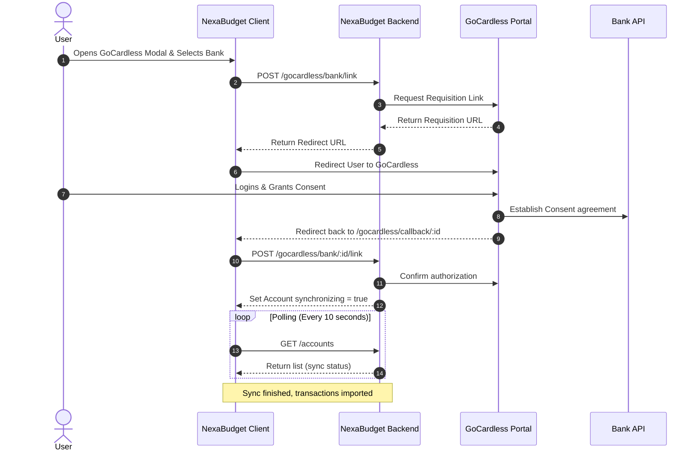
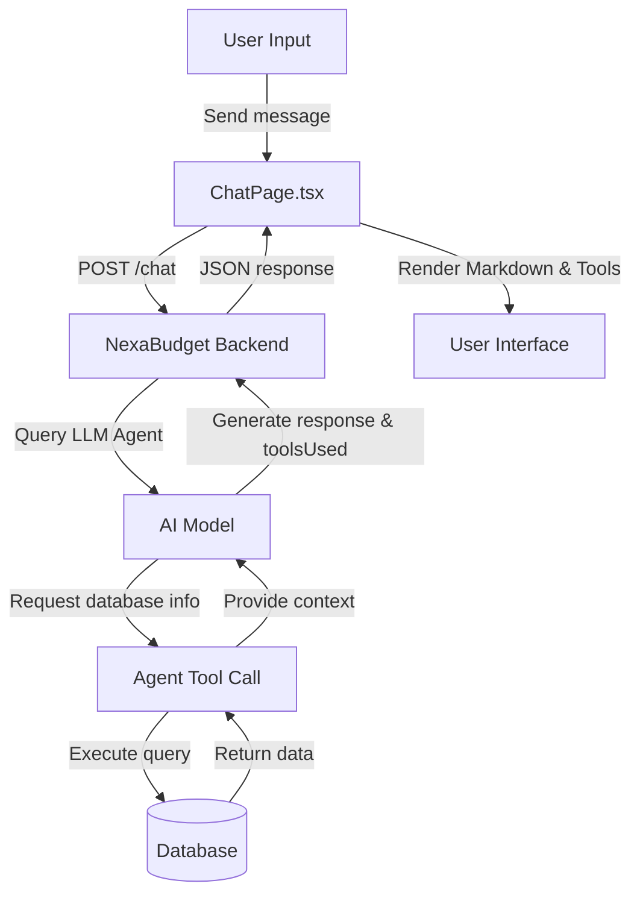

# Integrations & AI-Powered Features

NexaBudget Frontend goes beyond basic manual ledger tracking by integrating Open Banking standards, cryptocurrency exchange APIs, and advanced AI services. This document outlines the technical design of these integrations.

---

## 🏦 Bank Synchronization (GoCardless)

NexaBudget leverages **GoCardless** (formerly Nordigen) to securely connect to European bank accounts via the PSD2 Open Banking framework. This allows automated import of bank transactions and account balances.

### Linking & Sync Flow

The bank synchronization process is managed through a multi-step modal (`GoCardlessModal`) in the main layout and a callback route:

1. **Select Country**: The user chooses their bank's country (e.g. Italy, UK). The client fetches the list of supported institutions:
    `api.getGoCardlessBankList(countryCode)`
2. **Select Institution**: The user selects their bank from the returned list.
3. **Initiate Link Request**: The client requests a secure consent link from the backend:
    `api.getGoCardlessBankLink({ institutionId, localAccountId })`
    The backend creates a requisition with GoCardless and returns a redirect URL.
4. **User Consent**: The application redirects the user to the GoCardless portal, where they authenticate with their bank and authorize read-only access.
5. **Redirect Callback**: Upon successful authorization, GoCardless redirects the user back to the application callback URL:
    `/gocardless/callback/:accountId`
    The callback page (`GoCardlessCallbackPage.tsx`) captures the parameters and sends a completion request to the backend:
    `api.linkGoCardlessBankAccount(localAccountId, { accountId })`
6. **Polling Synchronization Status**:
    Once linked, the account's `synchronizing` property is set to `true`. While any account is synchronizing, the main application `Layout` initiates a polling interval:
    * Checks `/api/accounts/` every 10 seconds.
    * Stops polling once all accounts report `synchronizing: false`.

---

## 🪙 Cryptocurrency Portfolios

NexaBudget tracks digital assets through exchange API read-only integrations and manual asset entry:

### 1. Exchange API Keys (Binance & Coinbase)

Users can connect their exchange portfolios by entering read-only API keys:

* **Binance**: Keys are submitted via `api.saveBinanceKeys({ apiKey, apiSecret })`.
* **Coinbase**: Keys are submitted via `api.saveCoinbaseKeys({ apiKeyName, privateKey })`.
* *Note: For security, API keys are never stored on the client side; they are transmitted to the backend over HTTPS and saved securely server-side.*

Once keys are set, users can trigger manual synchronization directly from the UI (`CryptoPage.tsx`):

* `api.syncFromBinance()`
* `api.syncFromCoinbase()`

### 2. Manual Holdings

For assets stored in cold wallets or untracked exchanges, users can manage manual holdings:

* Add holding: `api.addManualHolding({ symbol, amount })`
* Update holding quantity: `api.updateManualHolding(id, { amount })`
* Delete holding: `api.deleteManualHolding(id)`

### 3. Valuation Aggregation

The crypto portfolio page calls `api.getPortfolioValue(currency)` on mount. The backend queries real-time pricing feeds for all registered assets (API-synced and manual), converts their value to the user's preferred currency, and returns:

* Aggregated portfolio total value.
* Individual asset breakdowns (symbol, amount, unit price, holding value).

---

## 🤖 AI-Powered Features

NexaBudget integrates large language model capabilities to provide intelligent financial insights, automated categorization, and conversational support.

### 1. Financial Chatbot Assistant (`ChatPage.tsx`)

A dedicated assistant allows users to converse about their financial data.

* **Sessions**: Users can open multiple separate chat conversations. Conversations are listed via `api.getChatSessions()` and deleted using `api.deleteChatSession(sessionId)`.
* **Messages**: On selecting a session, `api.getChatSessionMessages(sessionId)` hydrates the thread.
* **Interaction**: The user types a message. The client sends it via `api.sendChatMessage({ sessionId, message })`.
* **Agent Tools**: The assistant can execute financial actions or query database statistics dynamically on the user's behalf. When tools are utilized, the response contains a `toolsUsed` array, indicating which internal functions the model executed. The client displays these as tags (e.g., `get_transactions`, `get_accounts`) to maintain transparency.

### 2. AI Transactions Auto-Categorization

Manual transaction entry or bulk bank imports often result in uncategorized items. NexaBudget features an AI categorization job:

* The user initiates the process by calling `api.startCategorizationJob()`.
* The backend starts a background job that analyzes transaction descriptions and assigns appropriate categories.
* The client displays a progress indicator by polling `api.getCategorizationJobStatus(jobId)`. The job payload tracks the total, processed, and successfully categorized count.

### 3. AI Monthly Reports Analysis

In the Dashboard, the `AiAnalysisCard` lets users run deep audits of their spending patterns:

* **Trigger**: The user requests analysis for a specific timeframe: `api.requestAiAnalysis({ startDate, endDate, userLanguage })`.
* **Execution**: The backend schedules an asynchronous task that compiles transaction summaries, budgets, and trends, supplying them to an AI evaluator.
* **Polling**: The client queries `api.getAiAnalysisStatus(jobId)` until the status changes from `PENDING` to `COMPLETED`.
* **Display & Download**: The returned markdown analysis is rendered inside the UI. Users can also request a copy to download locally using `api.downloadAiAnalysis(jobId)` which yields a binary PDF document.
