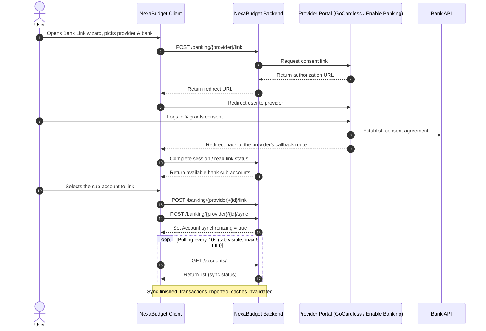
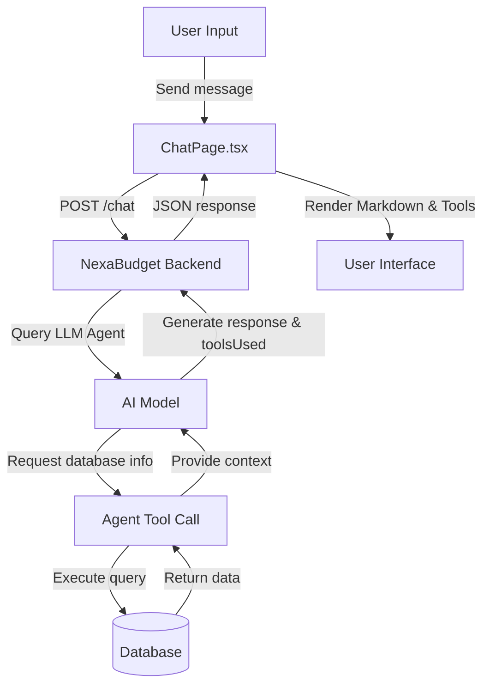

# Integrations & AI-Powered Features

NexaBudget Frontend goes beyond basic manual ledger tracking by integrating Open Banking standards, cryptocurrency exchange APIs, and advanced AI services. This document outlines the technical design of these integrations.

---

## 🏦 Bank Synchronization (Open Banking)

NexaBudget connects to European bank accounts under the PSD2 Open Banking framework through **two interchangeable providers**:

* **GoCardless** (formerly Nordigen)
* **Enable Banking**

Both are consumed through a single provider-agnostic backend API, `/api/banking/{provider}`, where `provider` is the slug `gocardless` or `enable-banking`. On the client, `api.providerSlug(account.provider)` derives that slug from an account's stored provider, so calling code stays provider-neutral. See [API Client Layer](api_client.md) for the endpoint list.

### Linking Flow

Linking is driven by the state machine in `src/hooks/useBankLink.ts` and rendered by `BankLinkModal`, mounted in the application shell so it can be opened from the sidebar or from any page via the outlet context (`onOpenBankLink`).

1. **Select Provider**: The user picks GoCardless or Enable Banking. When re-linking an account that is already associated with a provider (for example renewing an expired consent), this step is pre-filled and skipped.
2. **Select Country**: The user chooses their bank's country. The client fetches the list of supported institutions for the chosen provider:
    `api.getBankList(provider, countryCode)`
3. **Select Institution**: The user selects their bank from the returned list.
4. **Initiate Link Request**: The client requests a secure consent link from the backend:
    `api.getBankLink(provider, { institutionId, localAccountId })`
    The backend creates the requisition/session with the provider and returns a redirect URL.
5. **User Consent**: The application redirects the user to the provider's portal, where they authenticate with their bank and authorize read-only access.
6. **Redirect Callback**: the two providers differ here, so each has its own callback route and page:

    | Provider | Route | Page | How the account is identified |
    |---|---|---|---|
    | GoCardless | `/gocardless/callback/:accountId` | `GoCardlessCallbackPage.tsx` | Local account id in the path |
    | Enable Banking | `/banking/enable-banking/callback` | `EnableBankingCallbackPage.tsx` | `?code=…&state=<localAccountId>` in the query string |

    Enable Banking registers **one static redirect URL** for the whole application, which is why the local account id travels in `state` rather than in the path.

7. **Complete the session & pick a sub-account**:
    * The GoCardless page reads the link state with `api.getGoCardlessBankAccounts(accountId)` (the legacy endpoint, kept because it also returns `linkedStatus`, a pending link, and a failure `reason`). If the consent did not complete, it offers a *Reconnect* action that reopens the wizard.
    * The Enable Banking page exchanges the authorization code with `api.completeBankSession('enable-banking', localAccountId, { code })`, which returns the discovered bank accounts.
    * Both then render the shared `BankAccountPicker`, and on confirmation call `api.linkBankAccount(provider, localAccountId, { accountId })` followed by `api.syncBankAccount(provider, localAccountId, { actualBalance })`, before navigating to the account's transaction list.

### Sync Polling

Synchronization status polling lives in `src/hooks/useAccountSync.ts` (used by the shell), not in the page that started the link:

* Once a sync starts, the account's `synchronizing` property is `true`. While **any** account reports that state, the hook refreshes the account list every **10 seconds**, skipping ticks while the tab is hidden (`document.hidden`), and gives up after a **5-minute** safety timeout.
* When the last account flips back to `synchronizing: false`, the hook invalidates the transaction cache and raises a success notification.
* `handleSyncAllAccounts` triggers an on-demand sync for every current account that is linked to an external provider, reporting full, partial, or total failure.

```mermaid
sequenceDiagram
    autonumber
    actor User
    participant App as NexaBudget Client
    participant BE as NexaBudget Backend
    participant P as Provider Portal (GoCardless / Enable Banking)
    participant Bank as Bank API

    User->>App: Opens Bank Link wizard, picks provider & bank
    App->>BE: POST /banking/{provider}/link
    BE->>P: Request consent link
    P-->>BE: Return authorization URL
    BE-->>App: Return redirect URL
    App->>P: Redirect user to provider
    User->>P: Logs in & grants consent
    P->>Bank: Establish consent agreement
    P-->>App: Redirect back to the provider's callback route
    App->>BE: Complete session / read link status
    BE-->>App: Return available bank sub-accounts
    User->>App: Selects the sub-account to link
    App->>BE: POST /banking/{provider}/{id}/link
    App->>BE: POST /banking/{provider}/{id}/sync
    BE-->>App: Set Account synchronizing = true
    loop Polling every 10s (tab visible, max 5 min)
        App->>BE: GET /accounts/
        BE-->>App: Return list (sync status)
    end
    Note over App, BE: Sync finished, transactions imported, caches invalidated
```

---

## 🪙 Cryptocurrency Portfolios

NexaBudget tracks digital assets through exchange API read-only integrations and manual asset entry:

### 1. Exchange API Keys (Binance & Coinbase)

Users can connect their exchange portfolios by entering read-only API keys:

* **Binance**: Keys are submitted via `api.saveBinanceKeys({ apiKey, apiSecret })`.
* **Coinbase**: Keys are submitted via `api.saveCoinbaseKeys({ apiKeyName, privateKey })`.
* *Note: For security, API keys are never stored on the client side; they are transmitted to the backend over HTTPS and saved securely server-side.*

Once keys are set, users can trigger manual synchronization directly from the UI (`CryptoPage.tsx`), which also hosts the key and manual-holding modals:

* `api.syncFromBinance()`
* `api.syncFromCoinbase()`

### 2. Manual Holdings

For assets stored in cold wallets or untracked exchanges, users can manage manual holdings:

* Add holding: `api.addManualHolding({ symbol, amount })`
* Update holding quantity: `api.updateManualHolding(id, { amount })`
* Delete holding: `api.deleteManualHolding(id)`

### 3. Valuation Aggregation

The crypto portfolio page calls `api.getPortfolioValue(currency)` on mount. The backend queries real-time pricing feeds for all registered assets (API-synced and manual), converts their value to the user's preferred currency, and returns:

* Aggregated portfolio total value.
* Individual asset breakdowns (symbol, amount, unit price, holding value).

---

## 🔑 Programmatic API Keys

Separately from exchange credentials, `src/pages/settings/ApiKeysCard.tsx` manages NexaBudget's **own** API keys, for programmatic access to the user's data. `ApiKeyFormModal` creates or edits a key, and `ApiKeySecretModal` displays the generated secret once, at creation time, since it is not retrievable afterwards.

---

## 🤖 AI-Powered Features

NexaBudget integrates large language model capabilities to provide intelligent financial insights, automated categorization, and conversational support.

### 1. Financial Chatbot Assistant (`ChatPage.tsx`)

A dedicated assistant (NexaBot) allows users to converse about their financial data.

* **Sessions**: Users can open multiple separate chat conversations. Conversations are listed via `api.getChatSessions()` and deleted using `api.deleteChatSession(sessionId)`.
* **Messages**: On selecting a session, `api.getChatSessionMessages(sessionId)` hydrates the thread.
* **Interaction**: The user types a message. The client sends it via `api.sendChatMessage({ sessionId, message })`.
* **Rendering**: Replies arrive as Markdown and are rendered with `react-markdown` + `remark-gfm`.
* **Agent Tools**: The assistant can execute financial actions or query database statistics dynamically on the user's behalf. When tools are utilized, the response contains a `toolsUsed` array, indicating which internal functions the model executed. The client displays these as tags (e.g., `get_transactions`, `get_accounts`) to maintain transparency.

```mermaid
flowchart TD
    User[User Input] -->|Send message| Client[ChatPage.tsx]
    Client -->|POST /chat| BE[NexaBudget Backend]
    BE -->|Query LLM Agent| LLM[AI Model]
    LLM -->|Request database info| Tool[Agent Tool Call]
    Tool -->|Execute query| DB[(Database)]
    DB -->|Return data| Tool
    Tool -->|Provide context| LLM
    LLM -->|Generate response & toolsUsed| BE
    BE -->|JSON response| Client
    Client -->|Render Markdown & Tools| UI[User Interface]
```

### 2. AI Transactions Auto-Categorization

Manual transaction entry or bulk bank imports often result in uncategorized items. NexaBudget features an AI categorization job, started from the transactions page:

* The user initiates the process by calling `api.startCategorizationJob()`.
* The backend starts a background job that analyzes transaction descriptions and assigns appropriate categories.
* The client displays a progress indicator by polling `api.getCategorizationJobStatus(jobId)`. The job payload tracks the total, processed, and successfully categorized count.

### 3. AI Reports Analysis

In the Dashboard, the `AiAnalysisCard` lets users run deep audits of their spending patterns:

* **Trigger**: The user requests analysis for a specific timeframe: `api.requestAiAnalysis({ startDate, endDate, userLanguage })`.
* **Execution**: The backend schedules an asynchronous task that compiles transaction summaries, budgets, and trends, supplying them to an AI evaluator.
* **Polling**: The client queries `api.getAiAnalysisStatus(jobId)` until the status changes from `PENDING` to `COMPLETED`.
* **Display & Download**: The returned markdown analysis is rendered inside the UI. Users can also request a copy to download locally using `api.downloadAiAnalysis(jobId)` which yields a binary PDF document.

---

## 📥 Statement File Imports

Beyond Open Banking, transactions can be imported from files through `TransactionImportModal`, using a two-phase preview/confirm flow so nothing is written before the user validates the parse result:

* **CSV**: `api.previewCsvImport(accountId, file, mapping)` accepts a `CsvColumnMapping` — the column indices for date, amount, and description, plus an optional type column, `dateFormat`, `delimiter`, and `hasHeader` flag — then `api.confirmCsvImport(...)` commits the rows.
* **OFX**: `api.previewOfxImport(accountId, file)` followed by `api.confirmOfxImport(...)`; no mapping is needed, since OFX is structured.

Both upload as `FormData` (see [API Client Layer](api_client.md)).
